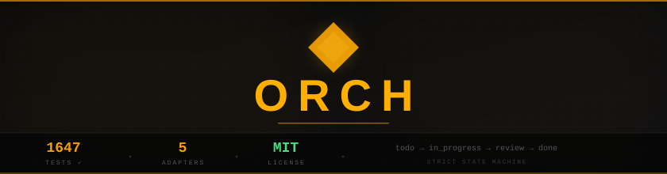
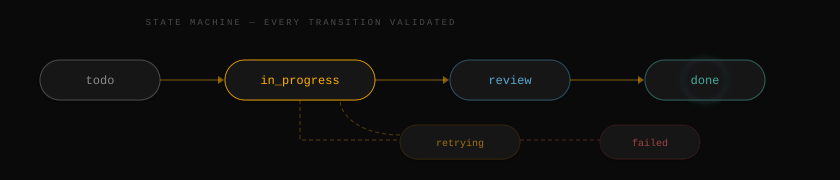
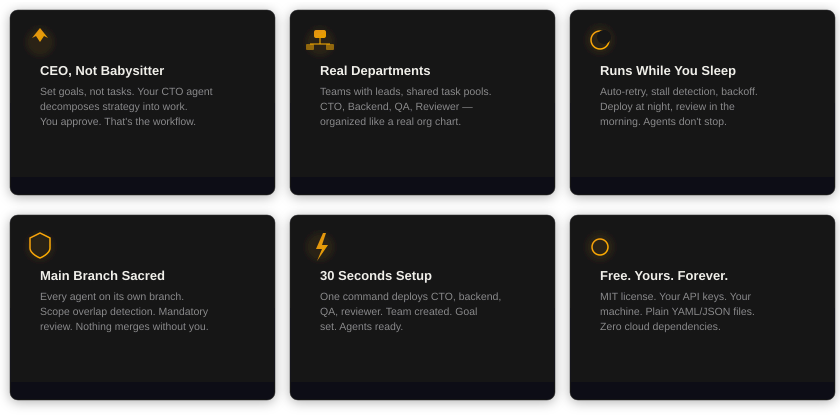
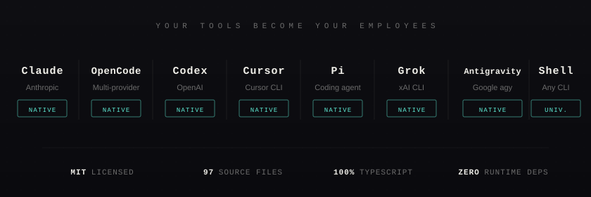
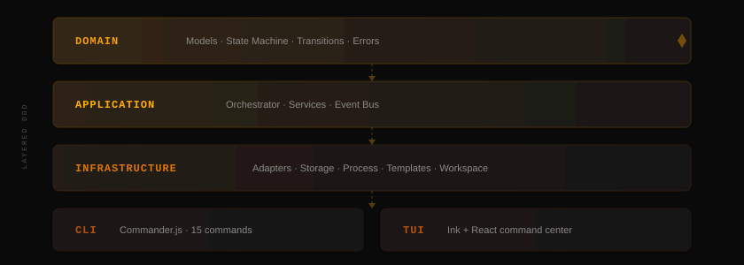

<!-- Hero Banner -->
<picture>
  <source media="(prefers-color-scheme: dark)" srcset="./assets/banner-dark.svg">
  <source media="(prefers-color-scheme: light)" srcset="./assets/banner-light.svg">
  
</picture>

<p align="center">
  <strong>Open-source orchestration for zero-human companies, processes and departments.</strong><br/>
  <sub>Engineering, editorial, sales, analytics — deploy entire AI departments from your terminal. Free forever.</sub>
</p>

<p align="center">
  <a href="https://github.com/oxgeneral/ORCH/stargazers"></a>&nbsp;
  <a href="https://www.orch.one/"></a>&nbsp;
  <a href="https://www.npmjs.com/package/@oxgeneral/orch"></a>&nbsp;
  <a href="LICENSE"></a>&nbsp;
  <a href="#development"></a>
</p>

<br/>

<p align="center">
  <a href="#you-re-still-babysitting-ai-agents">Problem</a> &bull;
  <a href="#launch-your-ai-company-in-30-seconds">Install</a> &bull;
  <a href="#your-ai-company-org-chart">Org Chart</a> &bull;
  <a href="#why-founders-choose-orch">Features</a> &bull;
  <a href="#pre-built-ai-companies">Templates</a> &bull;
  <a href="#full-cli-reference">CLI</a> &bull;
  <a href="#architecture">Architecture</a> &bull;
  <a href="#faq">FAQ</a>
</p>

```bash
npm install -g @oxgeneral/orch      # Install
cd ~/your-project && orch           # Launch TUI
```

```bash
orch org deploy startup-mvp --goal "Build auth with OAuth2"   # Deploy a team
orch run --all --watch                                         # Run all agents
```

<br/>

<!-- Divider -->
<picture>
  <source media="(prefers-color-scheme: dark)" srcset="./assets/divider-dark.svg">
  <source media="(prefers-color-scheme: light)" srcset="./assets/divider-light.svg">
  
</picture>

<br/>

<div align="center">
  <video src="https://github.com/user-attachments/assets/c7c3ab77-e718-4e5a-a8cf-bfc446ace64e" width="100%" controls autoplay loop muted></video>
</div>
<p align="center">
  <em>Command center: engineering shipping code, editorial publishing content, QA testing — all at once, while you sleep.</em>
</p>

<br/>

<!-- Divider -->
<picture>
  <source media="(prefers-color-scheme: dark)" srcset="./assets/divider-dark.svg">
  <source media="(prefers-color-scheme: light)" srcset="./assets/divider-light.svg">
  
</picture>

<br/>

## You're still babysitting AI agents

You have 3 AI assistants open. Claude is implementing auth in one terminal. Codex is writing tests in another. A shell script runs migrations somewhere else.

You're the human router — switching tabs, copy-pasting context, manually tracking who's doing what, restarting crashed agents at 2am.

**You're not the founder. You're the intern.**

<br/>

## What if you had an entire AI department?

```
$ orch org deploy startup-mvp --goal "Implement user auth with OAuth2"

  ✓ Deployed team "platform" — 5 agents
    CTO (claude)       → Decomposing goal into tasks...
    Backend A (claude)  → Waiting for tasks
    Backend B (codex)   → Waiting for tasks
    QA (codex)          → Waiting for tasks
    Reviewer (claude)   → Waiting for reviews

  ✓ CTO created 6 tasks from goal

$ orch run --all --watch

  22:03  ▶ Backend A    → "Implement OAuth2 flow"         [feature/oauth]
  22:03  ▶ Backend B    → "JWT token service"              [feature/jwt]
  22:03  ▶ QA           → waiting for implementations...
  22:15  ✓ Backend B    DONE  (12m · 4,200 tokens)
  22:15  ▶ QA           → "Test JWT service"               [test/jwt]
  22:22  ✓ Backend A    DONE  (19m · 8,100 tokens)
  22:24  ↻ QA           RETRY  attempt 2/3
  22:28  ✓ QA           DONE  (6m · 2,800 tokens)
  22:29  ▶ Reviewer     → "Review OAuth2 implementation"
  22:33  ✓ Reviewer     DONE  → all tasks in review

  → You went to sleep at 22:05.
  → You wake up to 6 tasks in review. Approve. Merge. Ship.
```

<p align="center"><strong>One goal. Five agents. Six PRs. Zero tab-switching. $4.20 in tokens.</strong></p>

<br/>

<!-- Divider -->
<picture>
  <source media="(prefers-color-scheme: dark)" srcset="./assets/divider-dark.svg">
  <source media="(prefers-color-scheme: light)" srcset="./assets/divider-light.svg">
  
</picture>

<br/>

## Launch your AI company in 30 seconds

<!-- Install Card -->
<picture>
  <source media="(prefers-color-scheme: dark)" srcset="./assets/install-dark.svg">
  <source media="(prefers-color-scheme: light)" srcset="./assets/install-light.svg">
  
</picture>

<br/>

That's it. ORCH auto-initializes, opens the TUI command center. Add agents and tasks right from there.

Or deploy a pre-built department:

```bash
orch org deploy startup-mvp --goal "Build invoicing SaaS with Stripe"
orch run --all --watch
```

<p align="center"><strong>Requirements:</strong> Node.js >= 20. That's it. No database. No cloud. No Docker.</p>

<br/>

<!-- Divider -->
<picture>
  <source media="(prefers-color-scheme: dark)" srcset="./assets/divider-dark.svg">
  <source media="(prefers-color-scheme: light)" srcset="./assets/divider-light.svg">
  
</picture>

<br/>

## Your AI company org chart

<table>
<tr>
<td width="50%" valign="top">

### CTO — strategic decomposition

Set a high-level goal. Your CTO agent decomposes it into concrete tasks, assigns priorities, and delegates to the right departments. You set strategy — AI executes.

### Engineering Department — parallel execution

Backend A, Backend B, Frontend — each agent gets its own git worktree (isolated branch). They work in parallel without file conflicts. Failed? Auto-retry with exponential backoff. Stalled? Zombie detection kills and re-queues.

</td>
<td width="50%" valign="top">

### QA Department — automated verification

QA agents pick up completed work, run tests, validate contracts. Reject with feedback → task goes back to engineering with your notes. The loop closes automatically.

### Inter-department communication

Agents talk to each other — direct messages, team broadcasts, shared context store. Backend finishes auth module → sends message to QA → QA starts testing. No copy-paste. No manual routing.

</td>
</tr>
</table>

### Code Review — mandatory quality gate

Nothing touches `main` until reviewed. Every task flows through the state machine:

<!-- State Machine -->
<picture>
  <source media="(prefers-color-scheme: dark)" srcset="./assets/statemachine-dark.svg">
  <source media="(prefers-color-scheme: light)" srcset="./assets/statemachine-light.svg">
  
</picture>

Every transition validated. No task gets lost. No code merges without approval.

<br/>

<!-- Divider -->
<picture>
  <source media="(prefers-color-scheme: dark)" srcset="./assets/divider-dark.svg">
  <source media="(prefers-color-scheme: light)" srcset="./assets/divider-light.svg">
  
</picture>

<br/>

## Not just engineering

ORCH orchestrates **any process** — not just code. The shell adapter runs any CLI tool, which means any workflow becomes a zero-human department:

| Department | Agents | What they do |
|-----------|--------|-------------|
| **Engineering** | Claude, Codex, Cursor | Write code, fix bugs, refactor |
| **Editorial** | Claude (writer), Claude (editor), Shell (grammarly) | Write articles, edit, check grammar, publish |
| **Sales Ops** | Shell (CRM scripts), Claude (copywriter), Shell (email sender) | Generate leads, write sequences, send outreach |
| **Analytics** | Shell (pandas, duckdb), Claude (analyst), Shell (matplotlib) | Clean data, compute KPIs, generate reports |
| **Content Factory** | Claude (strategist), Claude (writer x2), Claude (SEO) | Plan content calendar, write posts, optimize |
| **Security** | Shell (Semgrep, Trivy, Gitleaks), Claude (hunter) | Scan code, correlate findings, auto-fix |
| **DevOps** | Shell (terraform, kubectl), Claude (architect) | Plan infra changes, apply, verify |

Every department gets the same superpowers: state machine governance, retry, messaging, isolation, review gate.

<br/>

<!-- Divider -->
<picture>
  <source media="(prefers-color-scheme: dark)" srcset="./assets/divider-dark.svg">
  <source media="(prefers-color-scheme: light)" srcset="./assets/divider-light.svg">
  
</picture>

<br/>

## Why founders choose ORCH

<!-- Features Grid -->
<picture>
  <source media="(prefers-color-scheme: dark)" srcset="./assets/features-dark.svg">
  <source media="(prefers-color-scheme: light)" srcset="./assets/features-light.svg">
  
</picture>

<br/>

### Works with every tool — AI or not

<!-- Adapters -->
<picture>
  <source media="(prefers-color-scheme: dark)" srcset="./assets/adapters-dark.svg">
  <source media="(prefers-color-scheme: light)" srcset="./assets/adapters-light.svg">
  
</picture>

<br/>

The `shell` adapter is the key: **if it runs in a terminal, it's an employee** — `npm test`, `python bot.py`, Semgrep, `curl`, CRM scripts, data pipelines. This is how ORCH goes beyond engineering — any CLI tool becomes part of your zero-human company.

<br/>

<!-- Divider -->
<picture>
  <source media="(prefers-color-scheme: dark)" srcset="./assets/divider-dark.svg">
  <source media="(prefers-color-scheme: light)" srcset="./assets/divider-light.svg">
  
</picture>

<br/>

## Pre-built AI companies

Deploy a full department with one command:

**Engineering**

| Template | Agents | What it does |
|----------|--------|-------------|
| `startup-mvp` | CTO, Backend x2, Frontend, QA, Reviewer | Ship an MVP in 48 hours |
| `pr-review-corp` | Security, Performance, Style, QA, CTO | Automated review for every PR |
| `migration-squad` | CTO, Migrator x3, QA, Reviewer | JS-to-TS migration over a weekend |
| `security-dept` | Lead Auditor, Scanner, Secrets Auditor, Hunter, Reviewer | Multi-layer security audit |
| `test-factory` | Coverage Lead, Backend x2, QA x2, Reviewer | Coverage from 40% to 80% overnight |
| `bugfix-dept` | Triager, Fixer x3, QA, Reviewer | 100 issues to 0 in a week |

**Non-Engineering**

| Template | Agents | What it does |
|----------|--------|-------------|
| `content-agency` | Strategist, Writer x2, Editor, SEO | Content factory: plan, write, edit, optimize |
| `data-lab` | Lead Analyst, Data Engineer | 3 CSVs → executive report by morning |
| `sales-machine` | Sales Director, SDR x2, Copywriter, Growth Analyst | Outbound pipeline: research, outreach, follow-up, close |
| `docs-team` | Docs Lead, Writer x2, Editor, Reviewer | Technical docs from codebase analysis |

```bash
orch org list                                    # See all companies
orch org deploy startup-mvp                      # Deploy the default
orch org deploy startup-mvp --goal "Build X"     # Deploy with a goal
orch org export my-company                       # Save your setup as template
```

<br/>

<!-- Divider -->
<picture>
  <source media="(prefers-color-scheme: dark)" srcset="./assets/divider-dark.svg">
  <source media="(prefers-color-scheme: light)" srcset="./assets/divider-light.svg">
  
</picture>

<br/>

## Full CLI reference

<details>
<summary><strong>Setup & Diagnostics</strong></summary>

```bash
orch init                          # Initialize project
orch doctor                        # System diagnostics
orch update                        # Check for updates
```

</details>

<details>
<summary><strong>Departments & Agents</strong></summary>

```bash
orch agent add <name> --adapter claude --role "CTO — decomposes goals"
orch agent list                    # Status of all agents
orch agent disable/enable <id>     # Toggle availability
```

</details>

<details>
<summary><strong>Organization Templates</strong></summary>

```bash
orch org list                      # List available companies
orch org deploy <template>         # Deploy a full department
orch org deploy <template> --goal "..." # Deploy with a goal
orch org export <name>             # Export current setup
```

</details>

<details>
<summary><strong>Tasks</strong></summary>

```bash
orch task add "Title" -p 1         # Create task (priority 1-4)
orch task list                     # List all tasks
orch task assign <task> <agent>    # Manual assignment
orch task cancel <task>            # Cancel running task
```

</details>

<details>
<summary><strong>Teams (Departments)</strong></summary>

```bash
orch team create <name> --lead <agent-id>
orch team join <team-id> <agent-id>
orch team add-task <team-id> <task-id>
orch team disband <id>
```

</details>

<details>
<summary><strong>Goals (Strategy)</strong></summary>

```bash
orch goal add "Title" --description "..."
orch goal list
orch goal status <id> achieved
```

</details>

<details>
<summary><strong>Communication</strong></summary>

```bash
orch msg send <agent-id> "message"              # Direct message
orch msg broadcast "message" --team <team-id>   # Team broadcast
orch context set <key> <value>                  # Shared context
```

</details>

<details>
<summary><strong>Execution & Monitoring</strong></summary>

```bash
orch run --all --watch             # Launch all agents
orch run <task-id>                 # Run single task
orch status                        # Quick overview
orch logs <run-id>                 # View run logs
orch tui                           # Command center (TUI)
orch config edit                   # Open in $EDITOR
```

</details>

<p align="center"><strong>Aliases:</strong> <kbd>orchestry</kbd> &nbsp; <kbd>orch</kbd> &nbsp; <kbd>ao</kbd></p>

<br/>

<!-- Divider -->
<picture>
  <source media="(prefers-color-scheme: dark)" srcset="./assets/divider-dark.svg">
  <source media="(prefers-color-scheme: light)" srcset="./assets/divider-light.svg">
  
</picture>

<br/>

## Architecture

ORCH is an engine first, CLI second. The core has zero dependencies on CLI/TUI layers — you can import `@oxgeneral/orch` as a library and build your own interface.

<!-- Architecture Diagram -->
<picture>
  <source media="(prefers-color-scheme: dark)" srcset="./assets/architecture-dark.svg">
  <source media="(prefers-color-scheme: light)" srcset="./assets/architecture-light.svg">
  
</picture>

<br/>

<details>
<summary><strong>Directory structure</strong></summary>

```
src/
├── domain/           # Models, state machine, errors
├── application/      # Orchestrator engine, services, event bus
├── infrastructure/
│   ├── adapters/     # Claude, OpenCode, Codex, Cursor, Shell
│   ├── storage/      # File-based (YAML/JSON/JSONL)
│   ├── process/      # PID management, graceful kill
│   ├── template/     # LiquidJS prompt templates
│   └── workspace/    # Git worktree isolation
├── cli/              # Commander.js commands
└── tui/              # Ink + React command center
```

</details>

<br/>

## Development

```bash
npm run dev            # Run via tsx
npm run build          # Build ESM + DTS
npm test               # 1493 tests via Vitest
npm run typecheck      # Strict TypeScript
```

<br/>

<!-- Divider -->
<picture>
  <source media="(prefers-color-scheme: dark)" srcset="./assets/divider-dark.svg">
  <source media="(prefers-color-scheme: light)" srcset="./assets/divider-light.svg">
  
</picture>

<br/>

## Community

If ORCH saves you time — **[Star it on GitHub](https://github.com/oxgeneral/ORCH)** — it helps other founders find the project.

[](https://star-history.com/#oxgeneral/ORCH&Date)

- **Open an issue** if something breaks or could be better
- **Submit a PR** — see [CONTRIBUTING.md](CONTRIBUTING.md)

<br/>

## Used by / Early Adopters

> Running a zero-human company with ORCH? [Let us know](https://github.com/oxgeneral/ORCH/issues/new?title=Zero-human+company+with+ORCH&body=Tell+us+about+your+setup) — we'd love to feature you here.

<!-- ADOPTERS_START -->
*Be the first to launch your AI company here.*
<!-- ADOPTERS_END -->

<br/>

<!-- Divider -->
<picture>
  <source media="(prefers-color-scheme: dark)" srcset="./assets/divider-dark.svg">
  <source media="(prefers-color-scheme: light)" srcset="./assets/divider-light.svg">
  
</picture>

<br/>

## FAQ

<details>
<summary><strong>Do I need a team to use ORCH?</strong></summary>

<br/>

No. **Solo founders are the primary users.** You + 2 agents is already a zero-human company. ORCH gives you auto-retry, state machine, dashboard, and token tracking even with a single agent. Start with one, scale to departments.

</details>

<details>
<summary><strong>Will agents mess up my codebase?</strong></summary>

<br/>

No. Every agent works in an isolated git worktree on its own branch. Nothing touches `main` until you explicitly approve. Mandatory review step in the state machine. Scope overlap detection prevents conflicts before they happen.

</details>

<details>
<summary><strong>Is this only for engineering?</strong></summary>

<br/>

No. The shell adapter runs any CLI tool — which means ORCH orchestrates any process. Engineering, editorial, sales, analytics, security, DevOps. **If it runs in a terminal, it's an employee.** Deploy `content-agency`, `data-lab`, or `sales-machine` with one command.

</details>

<details>
<summary><strong>How much does it cost?</strong></summary>

<br/>

ORCH is free forever (MIT). You pay only for the AI APIs you already use (Claude, Codex, etc.). The TUI shows token counts per agent per run in real-time — no surprise bills.

</details>

<details>
<summary><strong>What AI tools does it support?</strong></summary>

<br/>

Five adapters: **Claude Code**, **OpenCode** (Gemini, DeepSeek, any OpenRouter model), **Codex**, **Cursor**, and **Shell** (any CLI tool). Your API keys, your tools — ORCH coordinates them.

</details>

<details>
<summary><strong>Is there a cloud component?</strong></summary>

<br/>

None. Zero cloud. All state in `.orchestry/` — plain YAML, JSON, JSONL files. No signup, no account, no data leaves your machine.

</details>

<details>
<summary><strong>How is this different from Paperclip?</strong></summary>

<br/>

Paperclip needs PostgreSQL, a web server, and cloud setup. ORCH needs `npm install`. Same vision — zero-human companies — but ORCH is the hacker's version: terminal-first, file-based, zero infrastructure, MIT licensed.

</details>

<br/>

<!-- Divider -->
<picture>
  <source media="(prefers-color-scheme: dark)" srcset="./assets/divider-dark.svg">
  <source media="(prefers-color-scheme: light)" srcset="./assets/divider-light.svg">
  
</picture>

<br/>

<p align="center">
  <a href="LICENSE"><strong>MIT</strong></a> — build whatever you want.
</p>

<br/>
