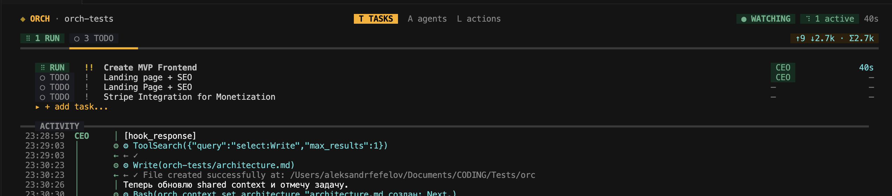

<p align="center">
  
  <p align="center">
    <strong>Stop babysitting AI agents. Start orchestrating them.</strong><br/>
    One CLI to run Claude, Codex, Cursor, and shell scripts as a team — in parallel, with retries, from your terminal.
  </p>
  <p align="center">
    <a href="https://landing-xi-murex.vercel.app/"></a>
    <a href="#get-started-in-30-seconds"></a>
    <a href="LICENSE"></a>
    <a href="#development"></a>
    <a href="#architecture"></a>
  </p>
</p>

---

<p align="center">
  
  <br/>
  <em>Real-time TUI dashboard: tasks running, agents working, activity streaming — all from one terminal.</em>
</p>

---

## You know the pain

You have 3 AI assistants open. Claude is implementing auth in one terminal. Codex is writing tests in another. A shell script runs migrations somewhere else.

You're the human router — switching tabs, copy-pasting context, manually tracking who's doing what, restarting crashed agents.

**That's not engineering. That's babysitting.**

## What if your AI agents worked like a real team?

```
$ orch run --all

  orch · watching · 3 running · 0 queued

  14:32  ▶ Backend A    → "Implement OAuth2 flow"
  14:32  ▶ Backend B    → "Write API integration tests"
  14:32  ▶ QA           → "Verify auth edge cases"
  14:35  ✓ Backend B    DONE  (3m 12s · 4,200 tokens)
  14:38  ✓ Backend A    DONE  (6m 44s · 8,100 tokens)
  14:39  ↻ QA           RETRY  attempt 2 · found regression
  14:41  ✓ QA           DONE  (2m 15s · 2,800 tokens)
```

One command. Three agents. Zero tab-switching.

## Get started in 30 seconds

```bash
git clone https://github.com/oxgeneral/ORCH.git && cd ORCH
npm install && npm run build

# Go to your project and launch
cd ~/your-project
orch
```

That's it. The TUI opens, you add agents and tasks right from the dashboard — no CLI memorization needed.

**Requirements:** Node.js >= 20

## Why teams choose ORCH

### Parallel execution that actually works
Run up to N agents simultaneously. ORCH handles dispatching, slot management, and prevents double-assignments. You set `max_concurrent_agents: 5` and forget about it.

### Agents that don't give up
Failed? ORCH retries with exponential backoff. Stalled? Automatic detection kills the zombie and re-queues. Crashed? The next tick picks it up. Your tasks finish even when individual runs fail.

### A real state machine, not a TODO list
```
todo → in_progress → review → done
                   ↘ retrying → in_progress
                   ↘ failed
```
Every transition is validated. No task gets lost. No agent runs something that's already done.

### Real-time dashboard in your terminal
```bash
orch          # launches TUI
```
Full-screen Ink/React dashboard with:
- Live task & agent status
- Activity feed with token counts
- Keyboard-driven: create tasks, assign agents, approve reviews — without leaving the terminal
- Command bar with `/task add`, `/agent add`, tab completion

### Zero infrastructure
All state lives in `.orchestry/` — YAML configs, JSON state, JSONL event logs. No database. No cloud. No Docker. `git clone` and you're running.

### Works with any AI tool
| Adapter | What it runs |
|---------|-------------|
| `claude` | Claude Code CLI (`claude --print`) |
| `codex` | OpenAI Codex CLI (`codex exec --json`) |
| `cursor` | Cursor Agent CLI (headless mode) |
| `shell` | Any command: `npm test`, `python bot.py`, custom scripts |

## Full CLI reference

```bash
# Setup
orch init                          # Initialize project
orch doctor                        # System diagnostics

# Tasks
orch task add "Title" -p 1         # Create task (priority 1-4)
orch task list                     # List all tasks
orch task assign <task> <agent>    # Manual assignment
orch task cancel <task>            # Cancel running task

# Agents
orch agent add <name> --adapter claude --role "Role description"
orch agent list                    # Status of all agents
orch agent disable/enable <id>     # Toggle availability

# Execution
orch run <task-id>                 # Run single task
orch run --all                     # Run everything
orch run --watch                   # Daemon mode

# Monitoring
orch status                        # Quick overview
orch logs <run-id>                 # View run logs
orch tui                           # Interactive dashboard

# Config
orch config edit                   # Open in $EDITOR
```

**Aliases:** `orchestry`, `orch`, `ao`

## Architecture

Clean DDD with dependency injection — no frameworks, no decorators, pure TypeScript:

```
src/
├── domain/           # Models, state machine, transitions
├── application/      # Orchestrator engine, services, event bus
├── infrastructure/
│   ├── adapters/     # Claude, Shell (pluggable)
│   ├── storage/      # File-based (YAML/JSON)
│   ├── process/      # PID management, graceful kill
│   └── workspace/    # Isolation modes (shared/worktree/isolated)
├── cli/              # Commander.js commands
└── tui/              # Ink + React dashboard
```

## Development

```bash
npm run dev            # Run via tsx
npm run build          # Build ESM + DTS
npm test               # 345 tests via Vitest
npm run typecheck      # Strict TypeScript
```

## Contributing

PRs welcome. See [CONTRIBUTING.md](CONTRIBUTING.md).

## License

[MIT](LICENSE) — use it however you want.
